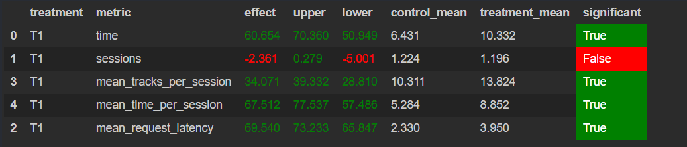

# Идея

Решил, что самым рабочим способом будет улучшить существующий нейросетевой рекоменедер Contextual.
Учитывал во внимание некоторые факты, которые видел на лекциях. Например, в своей версии я собираю
историю пользователя, чтобы не рокмендовать ему уже прослушанные треки, поскольку рейтинг трека
снижается, если слушать его несколько раз. Также я подумал, что можно рекомендовать треки
из топа с некоторой очередностью, чтобы пользователь не пропускал новые треки и шел в ногу со временем.
Но после нескольих прогоново оказалось, что зачастую рандомный выбор из топа работает плохо.
Поэтому я решил, что лучше будет рекомандовать треки из топа, с некоторой поправкой на личные предпочтения
пользователя. Отсюда появилась идея хранить треки, которые высоко оценил пользователь, генерировать реклмендации по ним
и рекомендовать их пересечение с топом. Также можно использовать хорошо оцененные треки для генерации новых, если
предыдщие были плохо оценены пользователем или не нашлось рекомендаций по треку.

# Реализация

Храню в классе Catalog необходимые данные по пользователям и трекам.
Мапа `self.user_history` хранит историю пользователя, а именно, какие треки он слушал.
Мапа `self.user_highly_rated` хранит треки, которые пользователь высоко оценил.
Мапа `self.user_listened_tracks_amount` хранит количество прослушанных треков пользователя.
Каждый 4 новый трек, если он плохой, то рекмендую что-то из топа по интересам пользователя.
Иначе рекомендую похожие на те, которые пользователь хорошо оценил.
Последнии полученный данные хранятся в файле: `jupyter/data/log/data.json`
Запускал командой:
```
python sim/run.py --episodes 1000 --config config/env.yml multi --processes 4
```

# Результат

